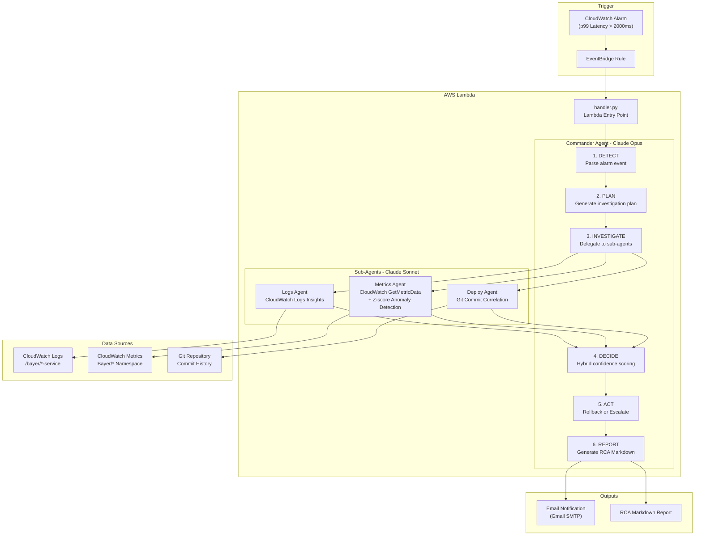
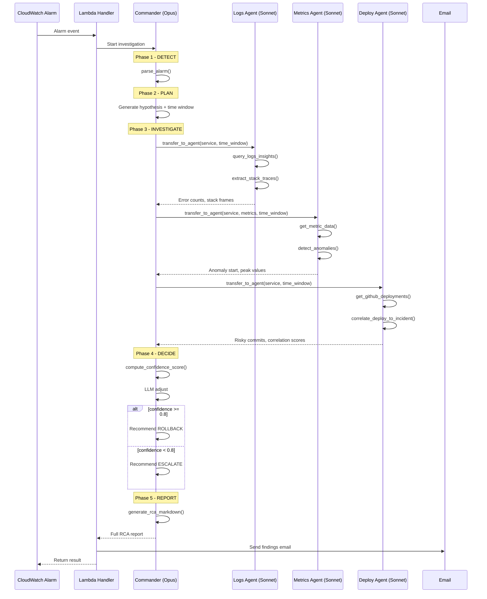

# Team 17 — Autonomous Incident Commander

| Member | Email |
|--------|-------|
| Lokesh Chimakurthi | lokeshchimakurthi19@gmail.com |
| Basudev Ghadai | ghadaibasudev1234@gmail.com |
| Narendra Sompalle | nsompalle@gmail.com |

The **Autonomous Incident Commander** eliminates the human scramble by turning a CloudWatch alarm into a full root-cause analysis in under 3 minutes. It receives an alarm event, spins up a Commander agent (Claude Opus) that orchestrates three specialist sub-agents (Claude Sonnet) in parallel — one digs through CloudWatch Logs for error spikes and stack traces, another detects metric anomalies via z-score analysis, and a third correlates recent Git deployments to the incident timeline. The Commander then fuses all evidence, computes a hybrid confidence score, and either recommends an automated rollback or escalates to a human — delivering a complete Markdown RCA report and an email notification, all within a single Lambda invocation.

---

## Architecture



---

## Agent Flow — Sequence of Operations



---

## Demo

### 1. CloudWatch Alarm Triggers

The `checkout-service-p99-latency-critical` alarm fires when p99 latency breaches 2000ms for 2 consecutive periods.


### 2. Metric Spike Detected

The p99 latency timeseries shows the spike that triggered the alarm — flat baseline followed by a sharp rise past the threshold.


### 3. Commander Agent Executes

The Lambda CloudWatch Logs show the full agent chain: DETECT → PLAN → INVESTIGATE (logs, metrics, deploy agents) → DECIDE → REPORT, with confidence scoring and RCA generation.


### 4. Email Report Delivered

The final RCA report is delivered via email with incident summary, evidence chain, and recommended action.


---

## Confidence Scoring Formula

The Commander uses a **hybrid deterministic + LLM** scoring model:

```
base = (logs_confidence × 0.35) + (metrics_confidence × 0.30) + (deploy_confidence × 0.35)
     + 0.05 if timestamp overlap (log errors ↔ metric anomalies)
     + 0.05 if deploy config matches error type
     - 0.20 per failed agent

final = base + LLM adjustment (±0.15 max, with explicit reasoning)
```

| Score | Action |
|-------|--------|
| >= 0.8 | **Rollback** — automated recommendation with target service + version |
| < 0.8 | **Escalate** — notify on-call team via email with all evidence |

---

## Tech Stack

| Component | Technology |
|-----------|------------|
| Agent Framework | **Google ADK** with `InMemoryRunner` |
| Commander LLM | **Claude Opus** via Amazon Bedrock (`bedrock/us.anthropic.claude-opus-4-6-v1`) |
| Sub-Agent LLMs | **Claude Sonnet 4.5** via Amazon Bedrock |
| Agent Delegation | ADK `sub_agents` + `transfer_to_agent` |
| Log Analysis | **CloudWatch Logs Insights** (`StartQuery` / `GetQueryResults`) |
| Metric Analysis | **CloudWatch GetMetricData** + Z-score anomaly detection |
| Deploy Analysis | **Git commit history** parsing + temporal correlation |
| Packaging | **ECR container** (`public.ecr.aws/lambda/python:3.12`) |
| Runtime | **AWS Lambda** |
| Notification | **Gmail SMTP** (email with HTML report) |
| Data Seeding | Local + Lambda seeders push mock data to CloudWatch |

---

## Project Structure

```
autonomous-incident-commander/
├── app/
│   ├── handler.py                  # Lambda entry point + email notification
│   ├── bootstrap.py                # ADK app init + A2A wiring
│   ├── agents/
│   │   ├── commander.py            # Commander agent (Opus) — orchestrator
│   │   ├── logs_agent.py           # Logs agent (Sonnet) — CW Logs Insights
│   │   ├── metrics_agent.py        # Metrics agent (Sonnet) — CW Metrics + anomaly
│   │   └── deploy_agent.py         # Deploy agent (Sonnet) — Git correlation
│   ├── tools/
│   │   ├── parse_alarm.py          # Extract incident context from alarm event
│   │   ├── cloudwatch_logs.py      # CloudWatch Logs Insights queries
│   │   ├── cloudwatch_metrics.py   # CloudWatch GetMetricData API
│   │   ├── anomaly_detector.py     # Z-score based anomaly detection
│   │   ├── stack_parser.py         # Stack trace extraction
│   │   ├── github_deployments.py   # Git commit history fetcher
│   │   ├── deploy_correlator.py    # Temporal deploy-incident correlation
│   │   ├── envelope.py             # Standard response wrapper
│   │   ├── report_generator.py     # RCA report builder
│   │   ├── notifier.py             # SNS notification (planned)
│   │   └── state_store.py          # DynamoDB persistence (planned)
│   └── prompts/                    # Prompt templates
├── seeder/                         # CloudWatch data seeder Lambda
├── mock_data/                      # Sample alarm, logs, metrics, deployments
├── infra/                          # CDK infrastructure stacks
├── tests/                          # Unit + integration tests
├── seed_local.py                   # Local data seeder (no Lambda needed)
├── Dockerfile                      # ECR container build
└── requirements.txt                # Python dependencies
```

---

## How to Run

### 1. Seed CloudWatch with mock data
```bash
python seed_local.py
```
This pushes mock logs and metrics into CloudWatch, time-shifted to the last 30 seconds for immediate queryability.

### 2. Invoke the Commander locally
```bash
python test_commander.py
```
This triggers the full DETECT → PLAN → INVESTIGATE → DECIDE → REPORT pipeline using the mock CloudWatch alarm event.

### 3. Deploy to AWS Lambda
Deployment is automated via **GitHub Actions** — every push to `main` builds the container, pushes to ECR, and updates the Lambda function.

---

## Sample Output

The Commander produces a structured **RCA Markdown report** containing:

- **Incident summary** — service, metric, threshold, detection time
- **Evidence chain** — causal links across logs, metrics, and deployments
- **Confidence score** — deterministic formula + LLM adjustment with reasoning
- **Recommended action** — rollback (with target version) or escalate
- **Per-agent findings** — error counts, anomaly timelines, risky commits

An **email notification** is automatically sent with the full HTML report upon completion.

---

## Future Scope

| # | Enhancement | Description |
|---|-------------|-------------|
| 1 | **DynamoDB State Persistence** | Persist incident findings, decisions, and RCA reports to DynamoDB for audit trails, post-incident review, and evaluation datasets |
| 2 | **CI/CD Code Quality Gates** | Add linting (ruff), type checking (mypy), and unit test enforcement to the GitHub Actions pipeline before deploy |
| 3 | **Automated Rollback Execution** | Move from mock/log-only ACT phase to real rollback via CodeDeploy or ECS service update when confidence exceeds threshold |
| 4 | **Slack Integration** | Replace email notifications with Slack webhooks for real on-call workflows |
| 5 | **Feedback Loop & Fine-Tuning** | Store human-validated RCA outcomes in DynamoDB and use them to calibrate confidence weights and improve prompt accuracy over time |